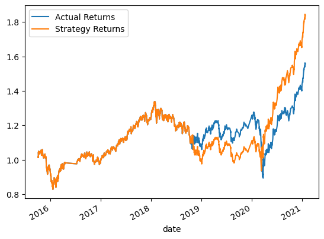

# Machine Learning Trading Bot

 

### The Actual Returns vs the Strategy Returns

 

 

### The Actual Returns vs the Strategy Returns with 6 Months Training Size

#### By increasing the training size to 6 months, the accuracy increases marginally. Not much impact is seen.

 

### The Actual Returns vs the Strategy Returns with Different SMA Window (Short - 4, Long - 120)

#### By modifying the SMA only marginal difference is noted in the accuracy.

 

### Evaluate a New Machine Learning Classifier - Linear Regression

#### This model did help increase the accuracy from 56 to 60, but overall not much of a difference has been seen. 
 